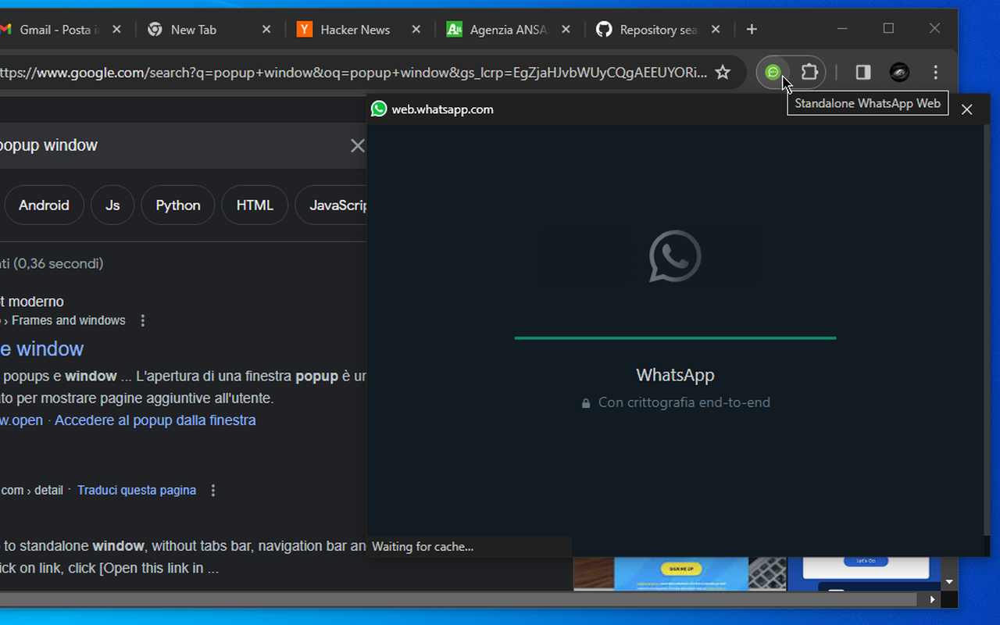

# Standalone WhatsApp Web
Open WhatsApp Web in a standalone popup window.

Chrome Extension on Chrome Web Store: https://chromewebstore.google.com/detail/standalone-whatsapp-web/kjaocoeofalpdjphifnjhnlnikpknglp

# Overview
Click the extension icon to open WhatsApp Web in a standalone popup window.

WhatsApp Web will open in a clean window (i.e. without forward/back buttons or bookmarks bar), 
so you can read and write your messages distraction-free, 
and always have them available in a separate window, away from your browsing tabs.

If you already have WhatsApp Web open, it will move that tab to the popup.

Right-click the extension icon and select "Re-attach as tab..." from the context menu to reattach WhatsApp Web as a tab in your currently open window.

Since v0.2.0 reports unread messages in the extension's icon.

DISCLAIMER: I'm not in any way affiliated with WhatsApp, just a happy user of it.
WhatsApp is a registered trademark owned by Meta.

Code: https://github.com/azrafe7/standalone-whatsapp-web

Please file bugs/feature requests at https://github.com/azrafe7/standalone-whatsapp-web/issues
